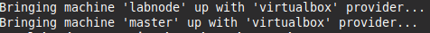
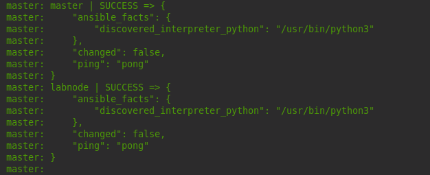
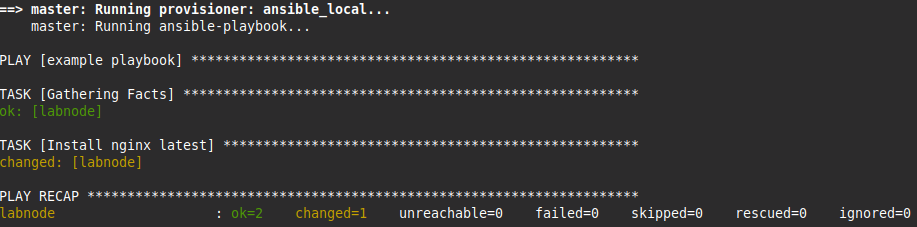

# Setup Ansible Lab
Create Ansible Lab for training purpose with Vagrant and VirtualBox

#### :hammer_and_wrench: Prerequisites

[](https://www.vagrantup.com/)
[](https://www.virtualbox.org/)

As a prerequisite, you need to have Vagrant and Virtualbox installed on your machine.

## Description
This lab has been created to try locally ad-hoc commands and playbooks to make server management easier by using declarative and idempotent configuration files.

Build an ansible master node and target node and deploy automatically a nginx server demo playbook.

## Features

Nodes definition map in Vagrantfile to define multiple scenarios

Using Hashicorp recommended chef boxes Bento project

Enabled SSH password authentication disabled by default in virtualbox VMs

SSH Key pair created and distributed private key securely between lab nodes

Not local Ansible installation required, installed in guest master VM and not deployed via vagrant.

Ansible installed through the python package manager(pip)

## Starting Up

To start up the lab run from command line

```shell
vagrant up

```


## Checking everything Ok

Once virtual machines are running and bootstrapped a ckecking script is run to verify that ansible lab is working properly running first an ad-hod ping command to lab nodes



and after that a demo playbook to a target node



## Shutting down

To shutdown the lab run from command line

```shell
vagrant halt

```
To destroy lab run from command line

```shell
vagrant destroy

```

